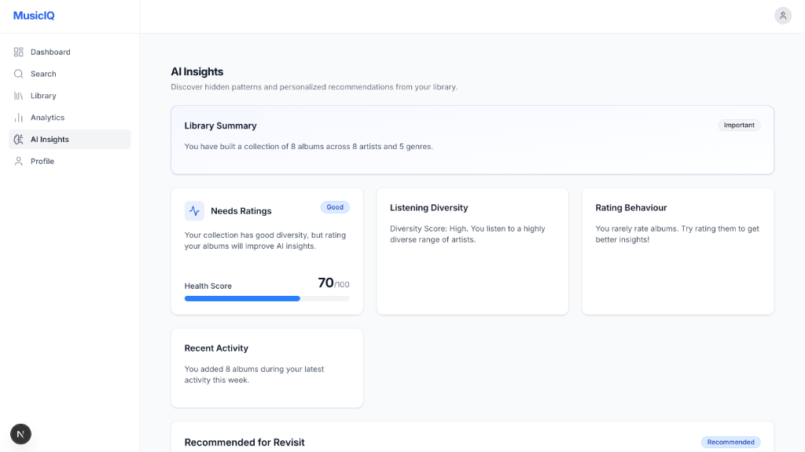
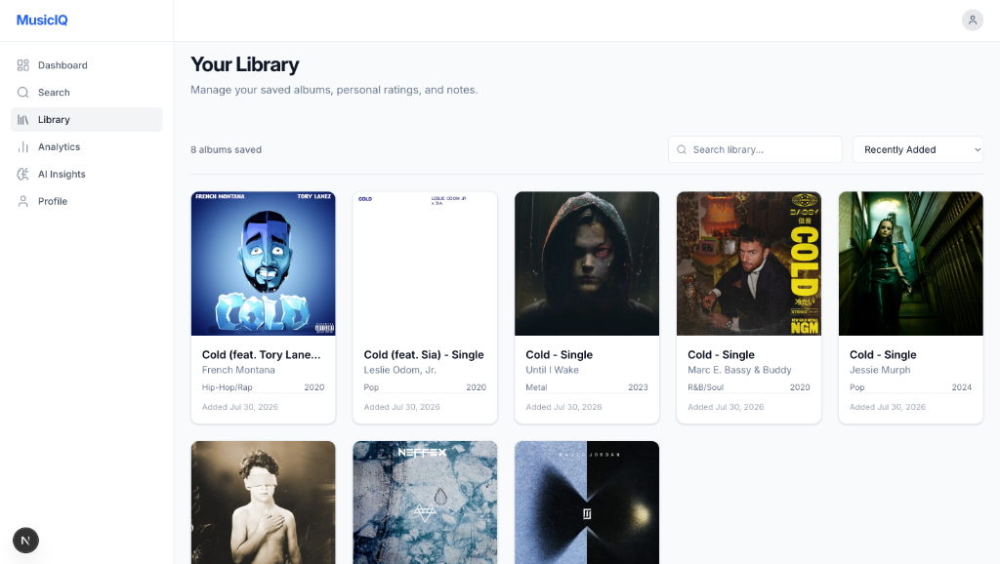
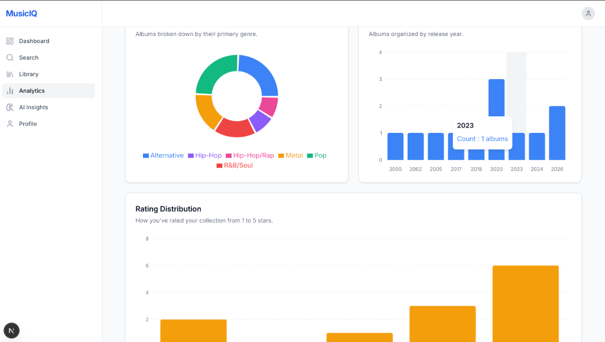
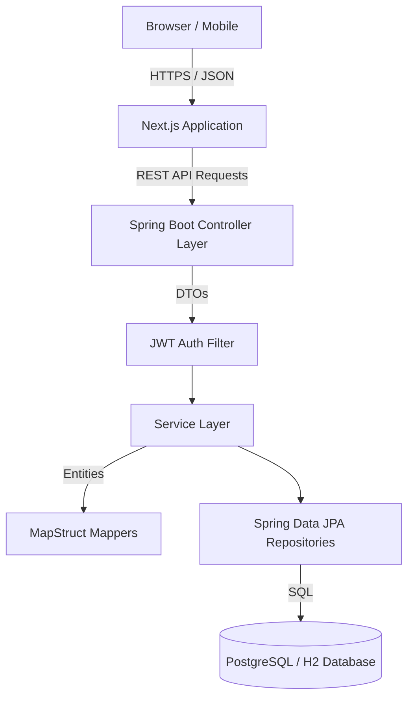
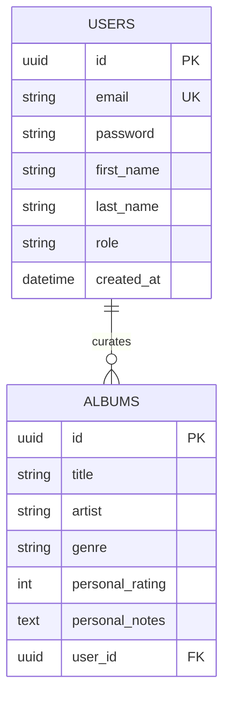

<div align="center">
  
  
  # MusicIQ

  **An intelligent full-stack music library platform featuring JWT authentication, real-time analytics, AI-powered insights, and modern clean architecture.**

  <p align="center">
    
    
    
    
    
    
    
    
    
    
  </p>
</div>

<br />


---

## 📑 Table of Contents
<details>
<summary>Click to expand</summary>

- [Project Overview](#-project-overview)
- [Key Features](#-key-features)
- [Screenshots](#-screenshots)
- [Architecture](#-architecture)
- [Tech Stack](#-tech-stack)
- [Folder Structure](#-folder-structure)
- [Database Design](#-database-design)
- [Authentication Flow](#-authentication-flow)
- [Analytics Engine](#-analytics-engine)
- [AI Insights](#-ai-insights)
- [REST API](#-rest-api)
- [Installation](#-installation)
- [Environment Variables](#-environment-variables)
- [Docker](#-docker)
- [CI/CD](#-cicd)
- [Testing](#-testing)
- [Engineering Decisions](#-engineering-decisions)
- [Performance](#-performance)
- [Security](#-security)
- [Roadmap](#-roadmap)
- [Contributing](#-contributing)
- [License](#-license)
- [Author](#-author)

</details>

---

## 🚀 Project Overview

### Problem Statement
Music enthusiasts often struggle to maintain a centralized, structured, and insightful repository of the albums they discover. Existing platforms are either heavily skewed toward streaming algorithms (ignoring personal curation) or rely on rudimentary spreadsheets that lack visual appeal, data validation, and meaningful analytics.

### Solution
**MusicIQ** bridges this gap by providing a beautiful, personalized music library application. It empowers users to search, save, and rate albums while automatically generating real-time analytics and intelligent recommendations based on their curated collection. 

### Design Philosophy
MusicIQ is built with a strong emphasis on **Clean Architecture, domain-driven design, and developer experience**. The backend strictly enforces layer boundaries (Controllers ↔ Services ↔ Repositories), while the frontend leverages modern React patterns, optimistic UI updates, and atomic component design to deliver a seamless user experience.

---

## ✨ Key Features

| Feature | Description |
| :--- | :--- |
| **Authentication** | Secure JWT-based stateless authentication with BCrypt password hashing. |
| **Album Search** | Lightning-fast search integration for discovering and importing new albums. |
| **Music Library** | Curate a personal collection with custom ratings, notes, and cover art. |
| **Analytics Dashboard** | Real-time visualization of collection health, genre distributions, and rating statistics. |
| **AI Insights** | Intelligent, rule-based recommendation engine offering personalized listening feedback. |
| **Profile Management** | Comprehensive user profile tracking join dates, activity, and preferences. |
| **Responsive UI** | Mobile-first, fully responsive TailwindCSS interface. |
| **Clean Architecture** | Strict separation of concerns on both backend (Spring Boot) and frontend (Next.js). |
| **Repository Pattern** | Abstracted database interactions ensuring testability and modularity. |
| **REST APIs** | Fully documented, strictly typed, true HTTP PATCH compliant API endpoints. |

---

## 📸 Screenshots

<details>
<summary><b>Dashboard Overview</b></summary>

</details>

<details>
<summary><b>Real-time Analytics</b></summary>

</details>

<details>
<summary><b>AI Insights Engine</b></summary>

</details>

<details>
<summary><b>Personal Library</b></summary>

</details>

<details>
<summary><b>Album Search</b></summary>

</details>

---

## 🏗 Architecture

MusicIQ employs a traditional layered architecture over a RESTful interface, separating the presentation layer (Next.js) from the business logic layer (Spring Boot).



---

## 💻 Tech Stack

| Category | Technology |
| :--- | :--- |
| **Frontend** | React 18, Next.js (App Router), TypeScript, Tailwind CSS, Lucide Icons |
| **State Management** | React Query (TanStack), Axios |
| **Backend** | Java 21, Spring Boot 3, Spring Security, Spring Web |
| **Database** | PostgreSQL (Production), H2 (Development/Testing), Spring Data JPA |
| **Data Mapping** | MapStruct, Lombok |
| **Authentication** | JSON Web Tokens (io.jsonwebtoken), BCrypt |
| **Build Tools** | Maven (Backend), npm (Frontend) |
| **Deployment** | Docker, Docker Compose, GitHub Actions |

---

## 📁 Folder Structure

```text
MusicIQ/
├── backend/                  # Spring Boot Application
│   ├── src/main/java/com/musiciq/backend/
│   │   ├── config/           # Application & Security Configurations
│   │   ├── controller/       # REST API Endpoints
│   │   ├── dto/              # Data Transfer Objects
│   │   ├── entity/           # JPA Domain Models
│   │   ├── exception/        # Global Exception Handling
│   │   ├── mapper/           # MapStruct Interfaces
│   │   ├── repository/       # Data Access Layer
│   │   ├── security/         # JWT Filters & Auth Providers
│   │   └── service/          # Business Logic
│   └── pom.xml               # Maven Dependencies
│
├── frontend/                 # Next.js Application
│   ├── src/
│   │   ├── app/              # Next.js App Router (Pages & Layouts)
│   │   ├── components/       # Reusable UI Components
│   │   ├── hooks/            # Custom React Hooks & React Query
│   │   ├── services/         # Axios API Clients
│   │   ├── types/            # TypeScript Interfaces
│   │   └── utils/            # Utility Functions
│   └── package.json          # NPM Dependencies
│
├── docs/                     # Documentation & Assets
│   └── screenshots/          # Application Images
└── docker-compose.yml        # Multi-container Orchestration
```

---

## 🗄 Database Design

The database is highly normalized to ensure data integrity and query efficiency.



---

## 🔐 Authentication Flow

MusicIQ implements a stateless, token-based authentication mechanism.

1. **Login**: Client sends `email` and `password` to `/api/auth/login`.
2. **Validation**: Spring Security authenticates the credentials via `AuthenticationManager`.
3. **JWT Issuance**: Backend signs and returns a cryptographically secure JWT (valid for 24 hours).
4. **Protected APIs**: Client attaches the token in the `Authorization: Bearer <token>` header for all subsequent requests.
5. **Logout**: Frontend clears the token from memory/local storage and invalidates the session locally.

---

## 📊 Analytics Engine

The Analytics Engine processes the user's library to deliver real-time metrics without slowing down the primary API.

- **Average Rating**: Calculated securely on the database level (`AVG()`) excluding null values.
- **Genre & Release Year Distribution**: Grouped queries mapped to specialized DTOs for Recharts frontend rendering.
- **Top Rated Albums**: Sorted dynamically by user ratings and recency.
- **Recent Activity**: Time-series tracking of library additions.

---

## 🧠 AI Insights

MusicIQ currently employs a **Rule-Based Recommendation Engine** to analyze listening habits, diversity scores, and rating behaviors. 

> **Note**: No external Large Language Model (LLM) is required to run the current iteration of the application. 

The architecture is explicitly designed using the **Provider Pattern**. This means integrating OpenAI, Gemini, or Claude in the future requires exactly **zero changes to the frontend APIs**. The backend `AiInsightsService` can simply swap its internal rule-based strategy for an LLM provider.

---

## 🔌 REST API

The API adheres to strict REST conventions, including proper HTTP status codes and `PATCH` semantics for partial updates.

### Examples

**Authenticate User**
```http
POST /api/auth/login
Content-Type: application/json

{
  "email": "user@example.com",
  "password": "securepassword123"
}
```

**Update Album (True PATCH Semantics)**
```http
PATCH /api/library/albums/{id}
Authorization: Bearer <token>
Content-Type: application/json

{
  "personalRating": 5,
  "personalNotes": "A timeless masterpiece."
}
```
*(Any omitted fields in the `PATCH` payload are safely ignored by the backend MapStruct implementation, preserving existing data).*

---

## 📦 Installation

### Prerequisites
- Java 21+
- Node.js 18+
- Maven
- (Optional) Docker & Docker Compose

### 1. Clone the Repository
```bash
git clone https://github.com/ANUPAM4545/MusicIQ.git
cd MusicIQ
```

### 2. Run the Backend (Spring Boot)
```bash
cd backend
./mvnw clean install
./mvnw spring-boot:run
```
*The backend will start on `http://localhost:8080` using an in-memory H2 database by default.*

### 3. Run the Frontend (Next.js)
```bash
cd frontend
npm install
npm run dev
```
*The frontend will start on `http://localhost:3000`.*

---

## ⚙️ Environment Variables

Create a `.env.local` file in the `frontend/` directory:

| Variable | Description | Default |
| :--- | :--- | :--- |
| `NEXT_PUBLIC_API_URL` | The base URL for the Spring Boot REST API | `http://localhost:8080/api` |

Create an `application-prod.yml` or configure standard Spring environment variables for the backend production database (PostgreSQL URL, Username, Password, JWT Secret).

---

## 🐳 Docker

The entire stack can be launched via Docker Compose for a production-like environment:

```bash
docker-compose up --build -d
```
This spins up the Next.js frontend, Spring Boot backend, and a PostgreSQL database container automatically linked together.

---

## 🔄 CI/CD

MusicIQ utilizes **GitHub Actions** to enforce code quality. 
- **Build & Test (Java)**: Automatically compiles the backend, runs unit tests, and verifies Checkstyle/Linting.
- **Build (Next.js)**: Runs ESLint, TypeScript type-checking, and generates a production build artifact for the frontend.

---

## 🧪 Testing & Quality Assurance

- **End-to-End Verification**: Complete user lifecycle tested from Registration -> Authentication -> Library Management -> Analytics.
- **PATCH Semantics Verification**: Rigorously audited `null` handling during partial updates ensuring data integrity.
- **Optimistic UI Testing**: Verified React Query cache invalidation and rollback mechanisms on network failures.

---

## 🛠 Engineering Decisions

- **Clean Architecture & Repository Pattern**: Ensures the backend is resilient to framework changes and highly testable. Controllers never touch the database.
- **MapStruct & DTOs**: Prevents over-posting attacks and decouples the internal JPA Entities from the external API contracts.
- **React Query (TanStack)**: Replaces complex Redux boilerplate with elegant, caching-first server state management.
- **True PATCH Semantics**: The backend leverages `NullValuePropertyMappingStrategy.IGNORE` to allow the frontend to send only the fields that actually changed, drastically reducing payload sizes and race conditions.

---

## ⚡ Performance

- **Caching**: The frontend caches analytical data for seamless navigation without redundant API calls.
- **Optimistic Updates**: When a user rates an album, the UI updates instantly while the request processes in the background.
- **Lazy Loading**: Chart libraries (Recharts) and heavy components are dynamically imported to keep the initial JS bundle size minimal.

---

## 🛡 Security

- **JWT Auth**: Stateless, tamper-proof tokens prevent session hijacking.
- **BCrypt Hashing**: Passwords are mathematically secured before hitting the database.
- **Ownership Validation**: Every single `GET`, `PATCH`, and `DELETE` request enforces ownership checks. A user can *never* access or modify another user's library.
- **Input Validation**: `jakarta.validation` annotations ensure malicious payloads are rejected before entering the Service layer.

---

## 🗺 Roadmap

- [ ] **LLM Integration**: Swap rule-based insights for an OpenAI/Gemini integration.
- [ ] **Spotify Integration**: Allow users to import playlists directly via OAuth.
- [ ] **Social Features**: Introduce collaborative playlists and sharing links.
- [ ] **Push Notifications**: Notify users on album anniversaries or new releases by saved artists.

---

## 🤝 Contributing

Contributions are what make the open-source community such an amazing place to learn, inspire, and create. Any contributions you make are **greatly appreciated**.

1. Fork the Project
2. Create your Feature Branch (`git checkout -b feature/AmazingFeature`)
3. Commit your Changes (`git commit -m 'Add some AmazingFeature'`)
4. Push to the Branch (`git push origin feature/AmazingFeature`)
5. Open a Pull Request

---

## 📄 License

Distributed under the MIT License. See `LICENSE` for more information.

---

## ✍️ Author

**Anupam Singh**

* [GitHub](https://github.com/ANUPAM4545)
* *Portfolio / LinkedIn coming soon*

---
<p align="center">
  <i>Built with ❤️ for music lovers everywhere.</i>
</p>
