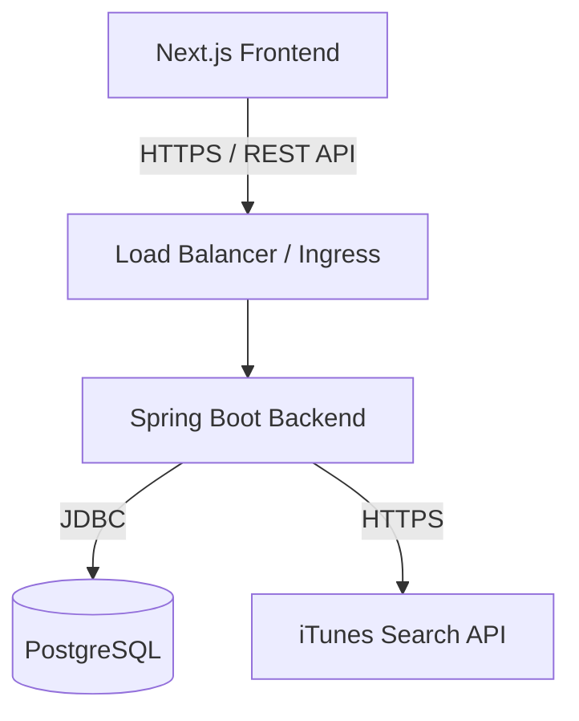

# Architecture Overview

MusicIQ is a full-stack SaaS application that provides users with a comprehensive dashboard to track, analyze, and manage their personal music libraries.

## High-Level Architecture

## Frontend (Next.js 15)

The frontend is built with React 19 and Next.js 15 App Router.
- **Styling**: Tailwind CSS v4 and shadcn/ui.
- **State Management**: React Query (TanStack Query) handles server state, caching, and invalidations.
- **Routing**: Next.js App Router for server-side and client-side transitions.

## Backend (Spring Boot 3)

The backend exposes a RESTful API.
- **Framework**: Spring Boot 3 with Java 21.
- **Security**: Spring Security with stateless JWT Authentication.
- **Database Access**: Spring Data JPA + Hibernate.

### Data Flow
1. Controllers intercept HTTP requests and perform initial validation.
2. Services contain business logic, handle third-party integrations (iTunes API), and calculate AI insights.
3. Repositories manage database interactions using Spring Data JPA.
