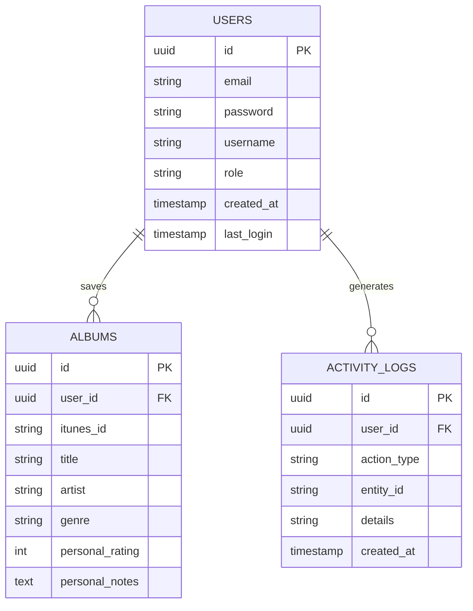

# Database Architecture

MusicIQ uses a relational database model managed by Spring Data JPA and Hibernate.
In development, it uses an embedded H2 database (persisted to the file system). In production, it utilizes PostgreSQL.

## Entity Relationship Diagram



## Data Isolation

Data isolation is strictly enforced at the repository layer. 
Every data fetch is scoped to the `user_id` extracted securely from the JWT token.

```java
List<Album> findByUserId(UUID userId);
```
